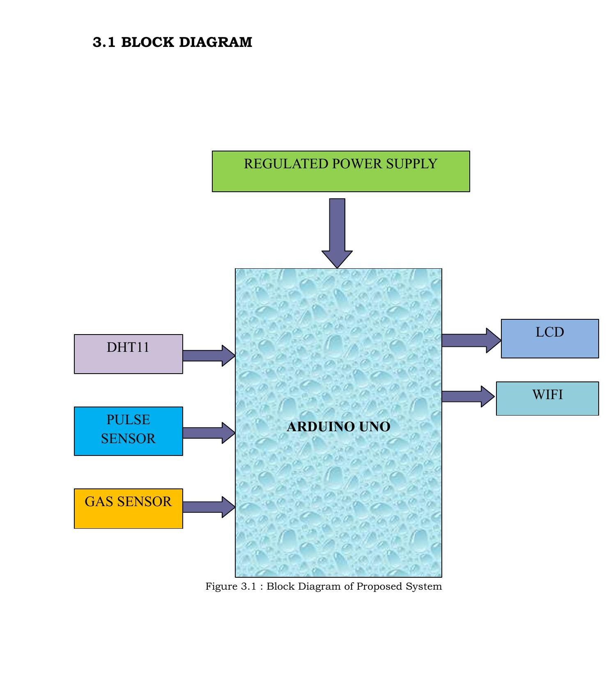
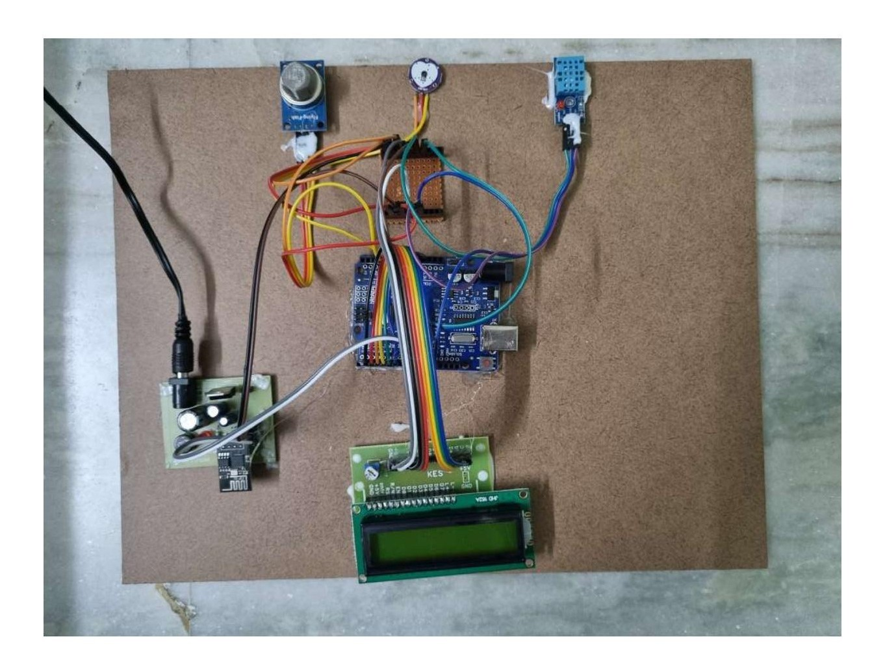
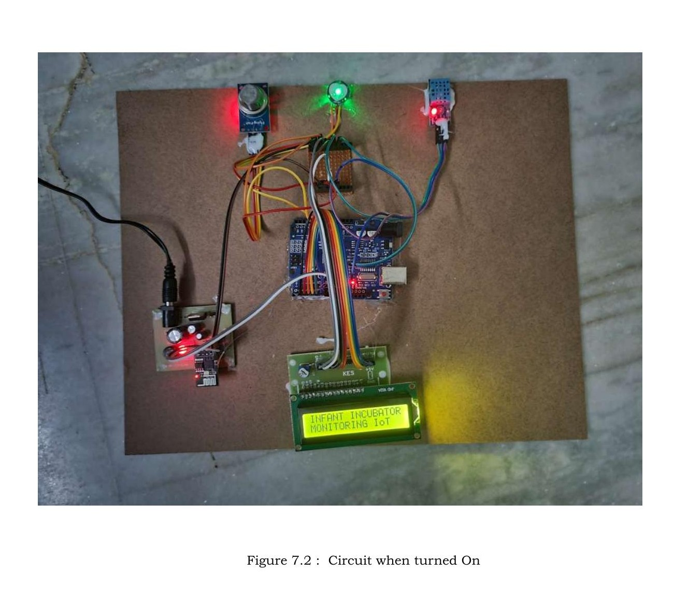

# IoT-Based Infant Incubator Monitoring System 👶📡

This project presents the design and implementation of an **IoT-based Infant Incubator Monitoring System** using Arduino. It focuses on monitoring critical environmental and health parameters of an infant in real time.

---

## 📌 Project Overview

This system continuously monitors:

- 🌡 Temperature  
- 💧 Humidity  
- 💓 Pulse Rate  
- 🧪 Gas Levels  

The data is:
- Displayed on an LCD
- Sent to the cloud (ThingSpeak) using WiFi (ESP8266)

This helps in ensuring a **safe and controlled environment** for newborns.

---

## 🎯 Objective

The goal of this project is to build a **low-cost and efficient monitoring system** that can:

- Monitor infant health parameters in real-time  
- Detect abnormal conditions  
- Enable remote monitoring using IoT  
- Assist caregivers in timely decision-making  

---

## 🧠 System Architecture

### Block Diagram

The system includes:

- Arduino Uno (Main controller)
- DHT11 Sensor (Temperature & Humidity)
- Pulse Sensor (Heart rate)
- Gas Sensor (Air quality)
- LCD Display (Real-time output)
- ESP8266 WiFi Module (Cloud connectivity)

📄 Refer to full project report:  
👉 :contentReference[oaicite:0]{index=0}

## ⚙️ Technologies & Tools Used

- Arduino IDE  
- Embedded C  
- IoT (ThingSpeak Cloud)  
- ESP8266 WiFi Module  
- Sensors interfacing  

---
## Results
## 📸 Project Photos

### Circuit (OFF State)

### Circuit (ON State)

### ESP8266 WiFi Module
  
- More accurate medical-grade sensors  
- AI-based health prediction  

---

## 📌 Note

This project is developed as part of my **B.Tech project**.  
More files like circuit diagrams, results, and explanations will be uploaded soon.

---

## 🤝 Contribution / Usage

You can use this project as:

- Reference for academic projects  
- Last-minute lab preparation  
- Beginner-level IoT learning  

---

## 👨‍💻 Author

**P Srihari**  
M.Tech – Signal Processing & Communication Engineering  
IIT Bhubaneswar  

GitHub: https://github.com/PSrihari2000  

---

## ⭐ If this helped you

Give a ⭐ to the repo — it helps others find it!
